好的，我们首先将23种设计模式按照创建型、结构型和行为型进行分组介绍，然后再逐个详细介绍每种设计模式的用途、适用场景，并绘制相应的流程图以便理解。

## 一、分组介绍

#### 1. 创建型模式（5种）
创建型模式主要关注对象的创建过程，包括如何创建对象以及如何组装对象。常见的设计模式有：
- 单例模式（Singleton）
- 工厂方法模式（Factory Method）
- 抽象工厂模式（Abstract Factory）
- 建造者模式（Builder）
- 原型模式（Prototype）

#### 2. 结构型模式（7种）
结构型模式主要关注类和对象的组合，以实现更灵活的结构。常见的设计模式有：
- 适配器模式（Adapter）
- 桥接模式（Bridge）
- 组合模式（Composite）
- 装饰器模式（Decorator）
- 外观模式（Facade）
- 享元模式（Flyweight）
- 代理模式（Proxy）

#### 3. 行为型模式（11种）
行为型模式主要关注对象之间的交互和职责分配。常见的设计模式有：
- 责任链模式（Chain of Responsibility）
- 命令模式（Command）
- 解释器模式（Interpreter）
- 迭代器模式（Iterator）
- 中介者模式（Mediator）
- 备忘录模式（Memento）
- 观察者模式（Observer）
- 状态模式（State）
- 策略模式（Strategy）
- 模板方法模式（Template Method）
- 访问者模式（Visitor）

接下来，我们逐个介绍每种设计模式的用途、适用场景，并绘制相应的流程图。

## 二、逐个介绍

### 创建型模式

#### 1. 单例模式（Singleton）
**用途**：确保一个类只有一个实例，并提供一个全局访问点。
**场景**：如数据库连接池、日志对象等。
**Mermaid流程图**：

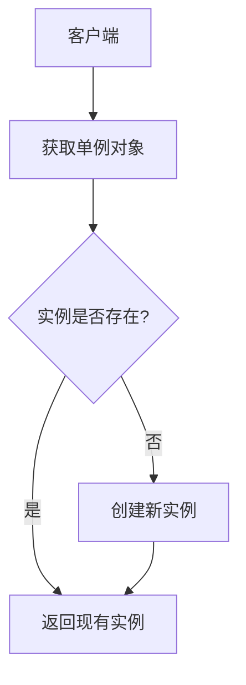

#### 2. 工厂方法模式（Factory Method）
**用途**：定义一个创建对象的接口，但让子类决定实例化哪一个类。
**场景**：如日志记录器、数据库连接器等。
**Mermaid流程图**：
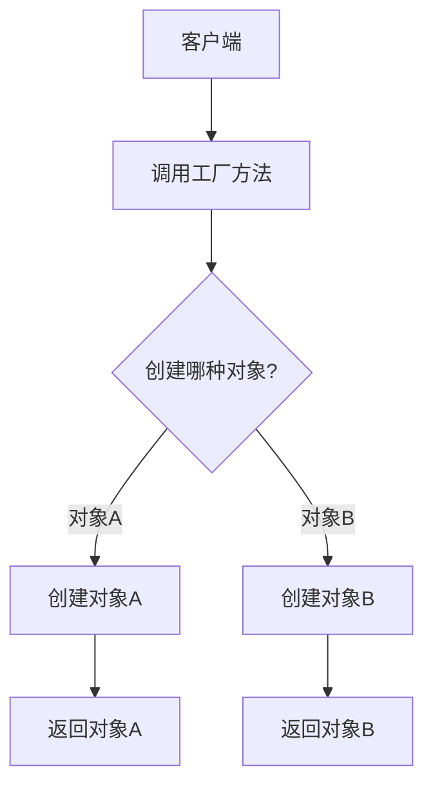

#### 3. 抽象工厂模式（Abstract Factory）
**用途**：提供一个创建一系列相关或相互依赖对象的接口，而无需指定它们具体的类。
**场景**：如UI库中的不同主题、操作系统中的不同风格控件等。
**Mermaid流程图**：
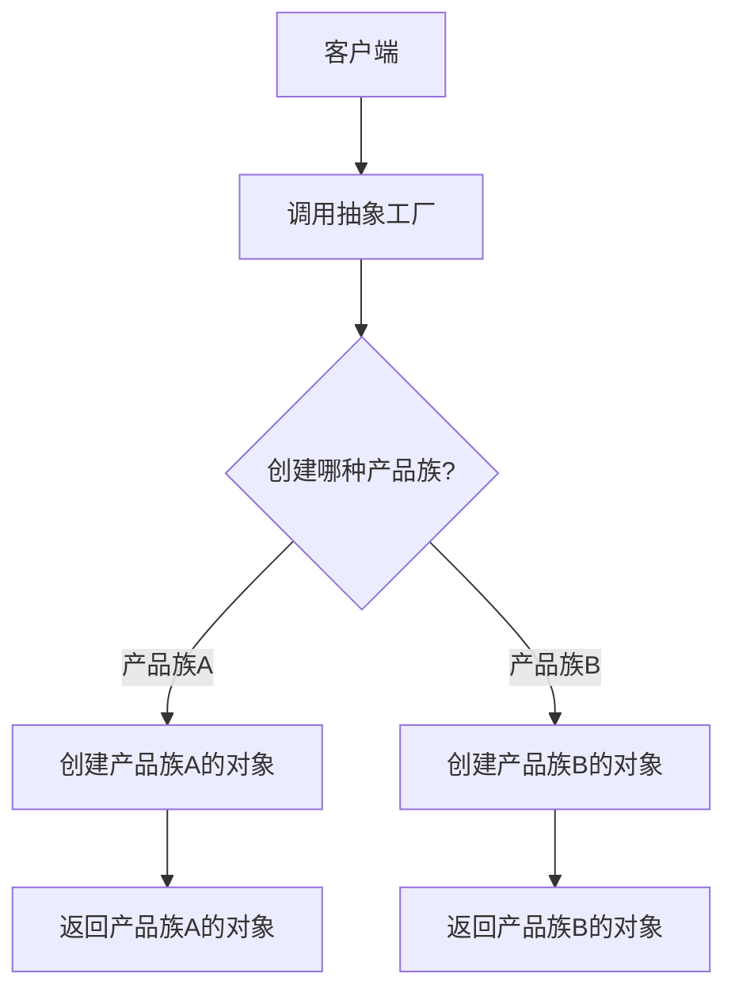
#### 4. 建造者模式（Builder）
**用途**：将一个复杂对象的构建与其表示分离，使得同样的构建过程可以创建不同的表示。
**场景**：如创建复杂的文档对象、生成不同类型的报告等。
**Mermaid流程图**：
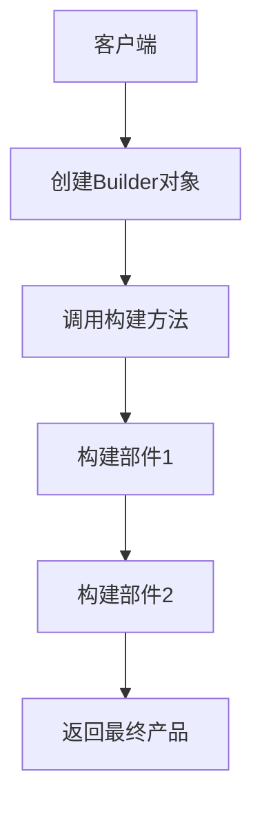

#### 5. 原型模式（Prototype）
**用途**：通过复制现有对象来创建新对象，而不是使用new关键字。
**场景**：如需要创建大量相似对象的场景。
**Mermaid流程图**：
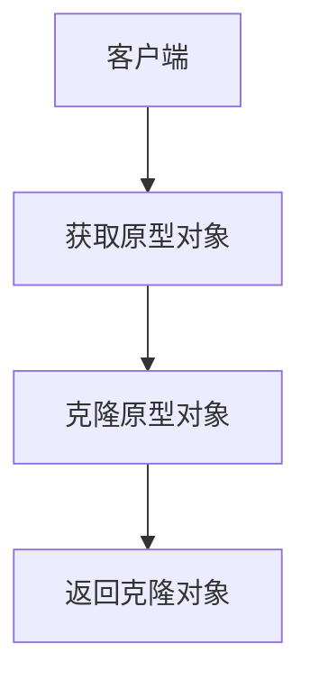

---

### 结构型模式

#### 6. 适配器模式（Adapter）

**用途**：将一个类的接口转换成客户端所期望的另一种接口。
**场景**：如兼容不同接口的库或框架。
**Mermaid流程图**：
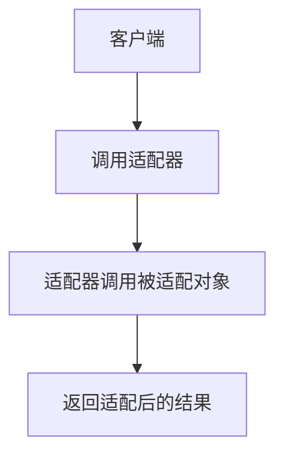

#### 7. 桥接模式（Bridge）
**用途**：将抽象部分与实现部分分离，使它们可以独立变化。
**场景**：如不同形状和颜色的组合。
**Mermaid流程图**：
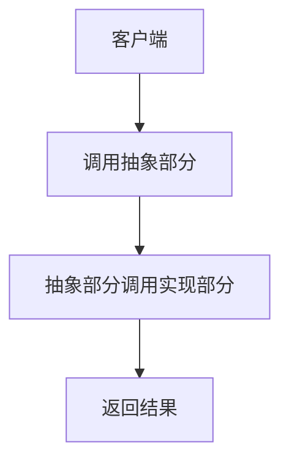

#### 8. 组合模式（Composite）
**用途**：将对象组合成树形结构以表示“部分-整体”的层次结构。
**场景**：如文件系统、组织架构等。
**Mermaid流程图**：
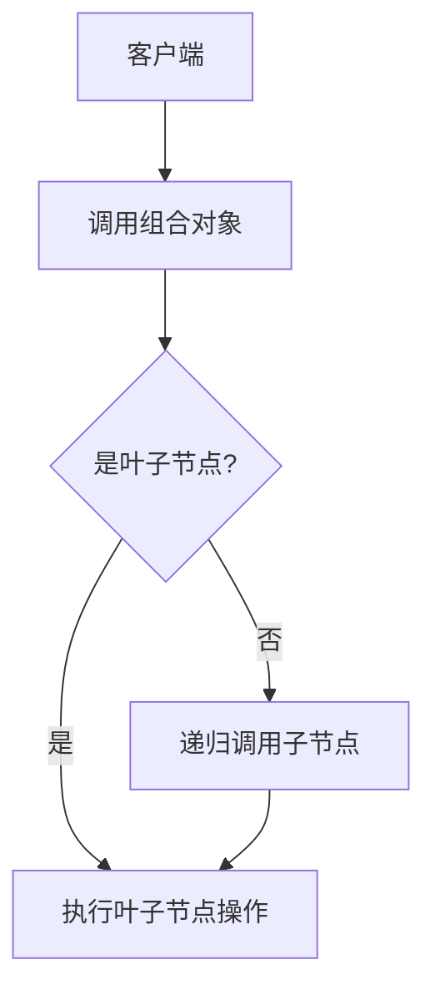

#### 9. 装饰器模式（Decorator）
**用途**：动态地给一个对象添加一些额外的职责。
**场景**：如为窗口添加滚动条、为文本添加颜色等。
**Mermaid流程图**：
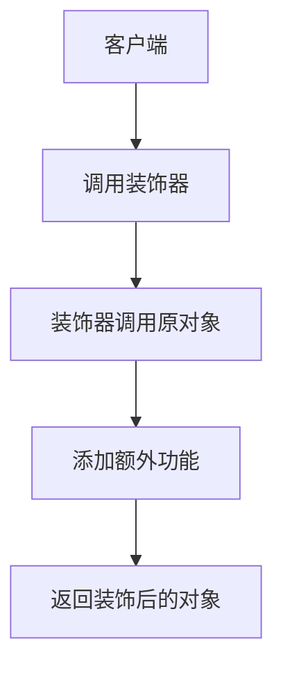

#### 10. 外观模式（Facade）
**用途**：为复杂的子系统提供一个简单的接口。
**场景**：如为复杂的库提供一个简化的API。
**Mermaid流程图**：
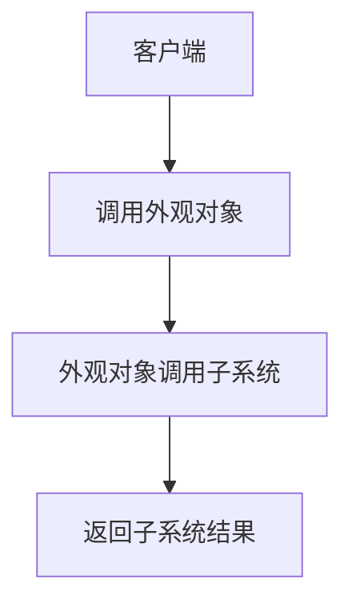

#### 11. 享元模式（Flyweight）
**用途**：共享大量细粒度的对象来节省内存。
**场景**：如文本编辑器中的字符对象、游戏中的粒子系统等。
**Mermaid流程图**：
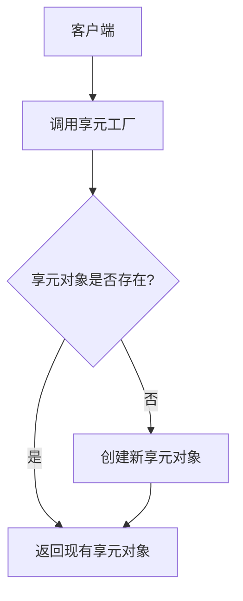

#### 12. 代理模式（Proxy）
**用途**：为其他对象提供一个代理，以控制对这个对象的访问。
**场景**：如远程代理、虚拟代理、保护代理等。
**Mermaid流程图**：
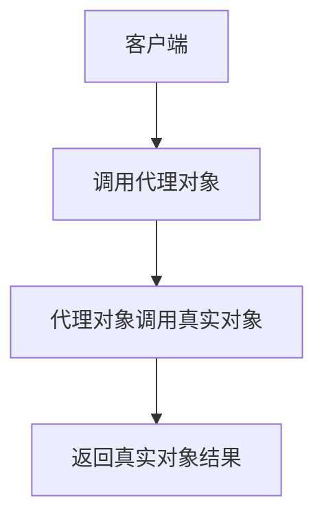

---

### 行为型模式

#### 13. 责任链模式（Chain of Responsibility）

**用途**：将请求的发送者和接收者解耦，使多个对象都有机会处理请求。
**场景**：如审批流程、异常处理等。
**Mermaid流程图**：
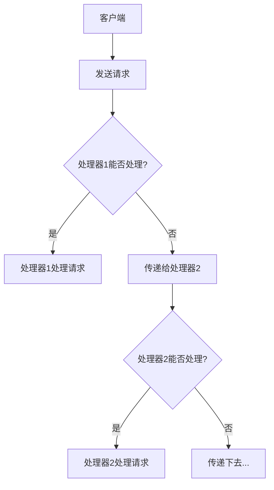

---

#### 14. 命令模式（Command）
**用途**：将请求封装为对象，从而使你可以用不同的请求、队列或日志参数化其他对象。
**场景**：如撤销/重做操作、任务队列等。
**Mermaid流程图**：
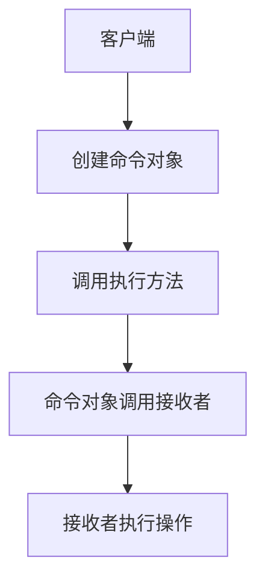

---

#### 15. 解释器模式（Interpreter）
**用途**：定义语言的语法表示，并提供一个解释器来解释该语言的句子。
**场景**：如正则表达式解释器、SQL解析器等。
**Mermaid流程图**：
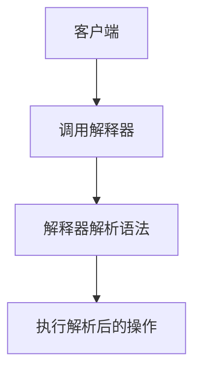

---

#### 16. 迭代器模式（Iterator）
**用途**：提供一种方法来顺序访问一个聚合对象中的各个元素，而不暴露其内部表示。
**场景**：如遍历集合、自定义迭代器等。
**Mermaid流程图**：
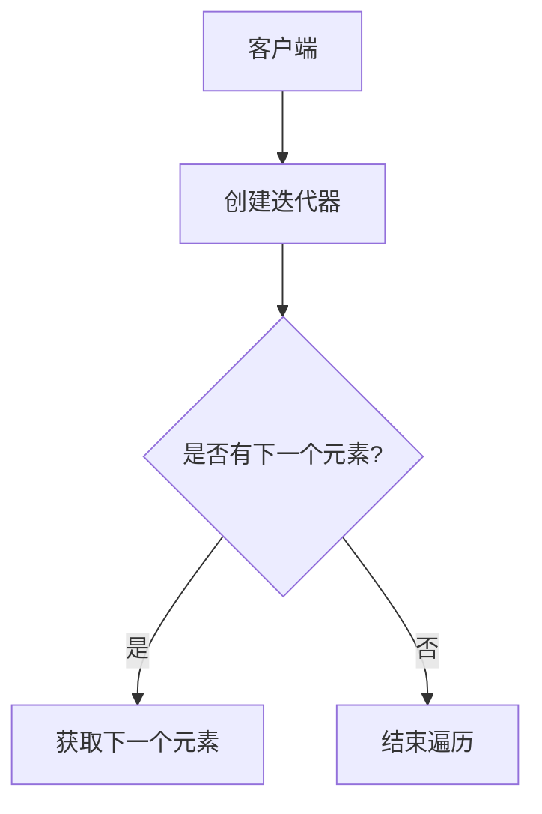

---

#### 17. 中介者模式（Mediator）
**用途**：用一个中介对象来封装一系列对象之间的交互，从而减少对象之间的直接依赖。
**场景**：如聊天室、GUI组件交互等。
**Mermaid流程图**：
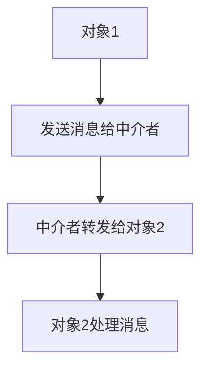

---

#### 18. 备忘录模式（Memento）
**用途**：在不破坏封装性的前提下，捕获一个对象的内部状态，并在之后恢复该状态。
**场景**如撤销操作、游戏存档等。
**Mermaid流程图**：
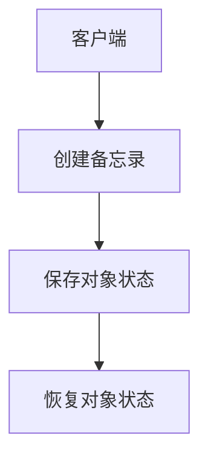

---

#### 19. 观察者模式（Observer）
**用途**：定义对象之间的一对多依赖关系，使得当一个对象状态改变时，所有依赖它的对象都会收到通知并自动更新。
**场景**：如事件处理、通知系统等。
**Mermaid流程图**：
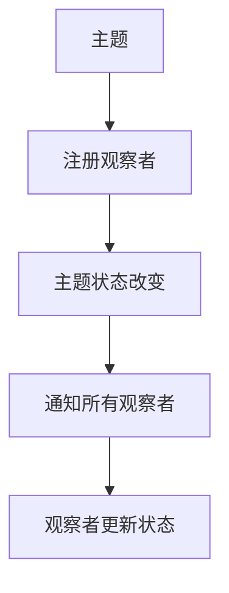

---

#### 20. 状态模式（State）
**用途**：允许一个对象在其内部状态改变时改变其行为。
**场景**：如有限状态机、订单状态切换等。
**Mermaid流程图**：
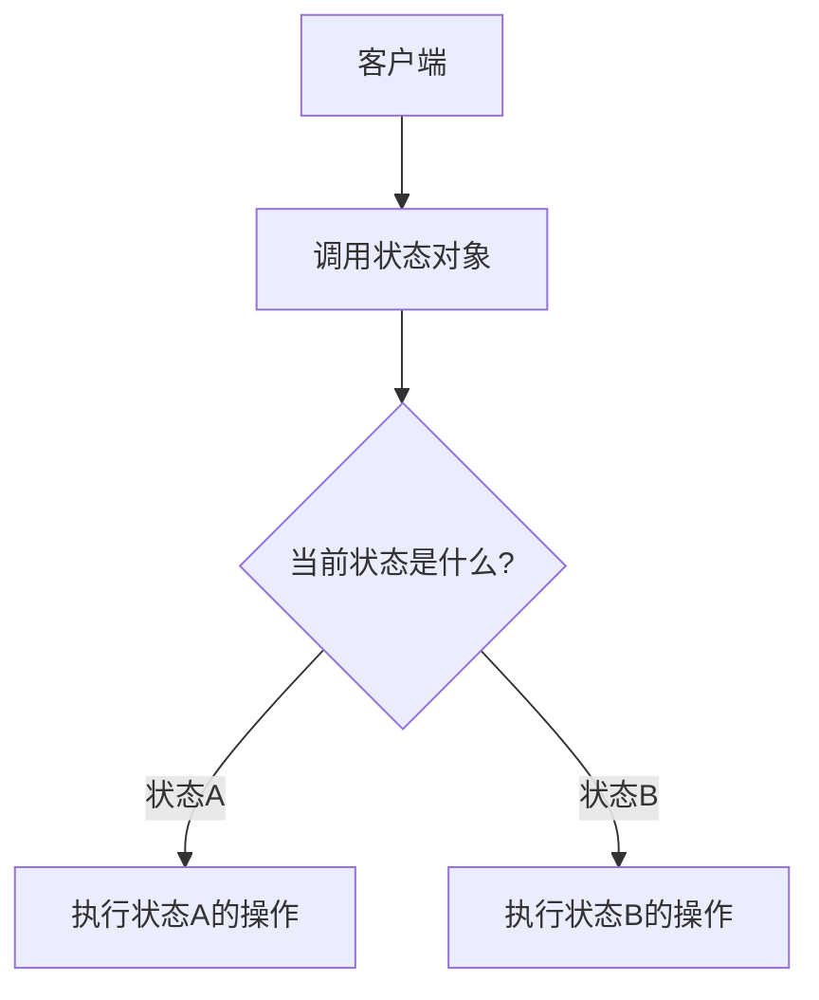

---

#### 21. 策略模式（Strategy）
**用途**：定义一系列算法，封装每个算法，并使它们可以互换。
**场景**：如排序算法、支付方式选择等。
**Mermaid流程图**：
```mermaid
flowchart TD
    A[客户端] --> B[选择策略]
    B --> C[执行策略算法]
    C --> D[返回结果]
```

---

#### 22. 模板方法模式（Template Method）
**用途**：定义一个操作中的算法骨架，而将一些步骤延迟到子类中实现。
**场景**如框架设计、流程控制等。
**Mermaid流程图**：
```mermaid
flowchart TD
    A[客户端] --> B[调用模板方法]
    B --> C[执行固定步骤]
    C --> D{是否有可变步骤?}
    D -- 是 --> E[调用子类实现的可变步骤]
    D -- 否 --> F[完成操作]
```

---

#### 23. 访问者模式（Visitor）
**用途**：将数据结构与数据操作分离，使得可以在不改变数据结构的前提下定义新的操作。
**场景**如编译器、文档处理等。
**Mermaid流程图**：
```mermaid
flowchart TD
    A[客户端] --> B[创建访问者]
    B --> C[调用访问者访问数据结构]
    C --> D[访问者执行操作]
```

---
