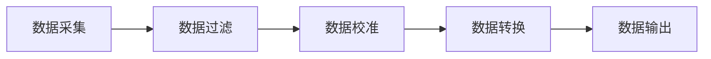

# 管道模式

管道模式（Pipeline Pattern）是一种软件设计模式,属于策略模式的变种，广泛应用于处理数据流。其核心思想是将数据处理过程划分为多个阶段（或称为“管道”），每个阶段负责处理特定的任务，并将处理后的数据传递给下一个阶段。这种模式非常适合用于嵌入式系统中的数据流处理。

在嵌入式系统中，管道模式可以用于传感器数据采集、信号处理、传输和显示等多个场景。以下是一些具体的应用场景和实现思路：

1. **数据采集与处理**：例如，从传感器采集数据后，经过滤波、校准、转换等步骤，最终将处理后的数据输出或存储。

2. **通信数据处理**：例如，在无线通信模块中，接收到的数据需要经过解包、校验、解析等步骤，最终将解析后的数据传递给应用层。

3. **多任务处理**：将复杂的任务分解为多个简单的步骤，每个步骤由一个管道阶段处理，可以提高系统的模块化和可维护性。

### 管道模式的优点：
1. **模块化**：每个阶段负责一个特定的任务，易于代码的维护和扩展。
2. **灵活性**：可以灵活地添加或删除处理阶段，适应不同的需求。
3. **并行处理**：在支持多核或多线程的嵌入式系统中，不同阶段可以并行执行，提高处理效率。

以下是一个管道模式的简单示例（使用Mermaid语法描述）：

在这个示例中，数据从采集阶段开始，依次经过过滤、校准、转换等阶段，最终输出处理后的数据。

